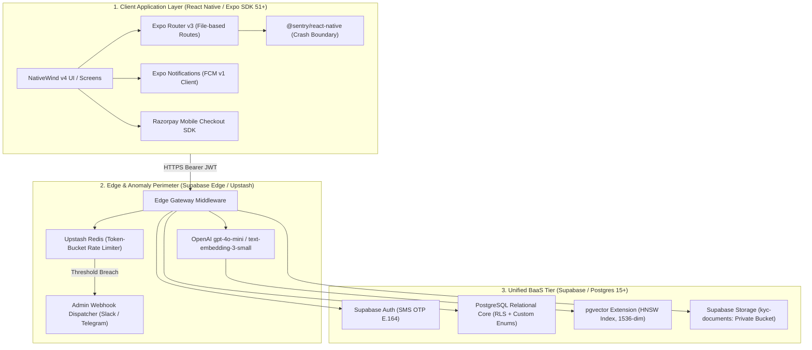
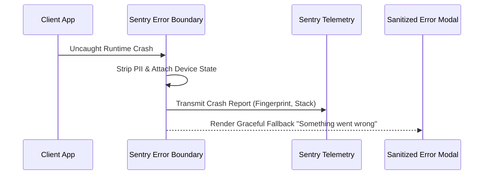
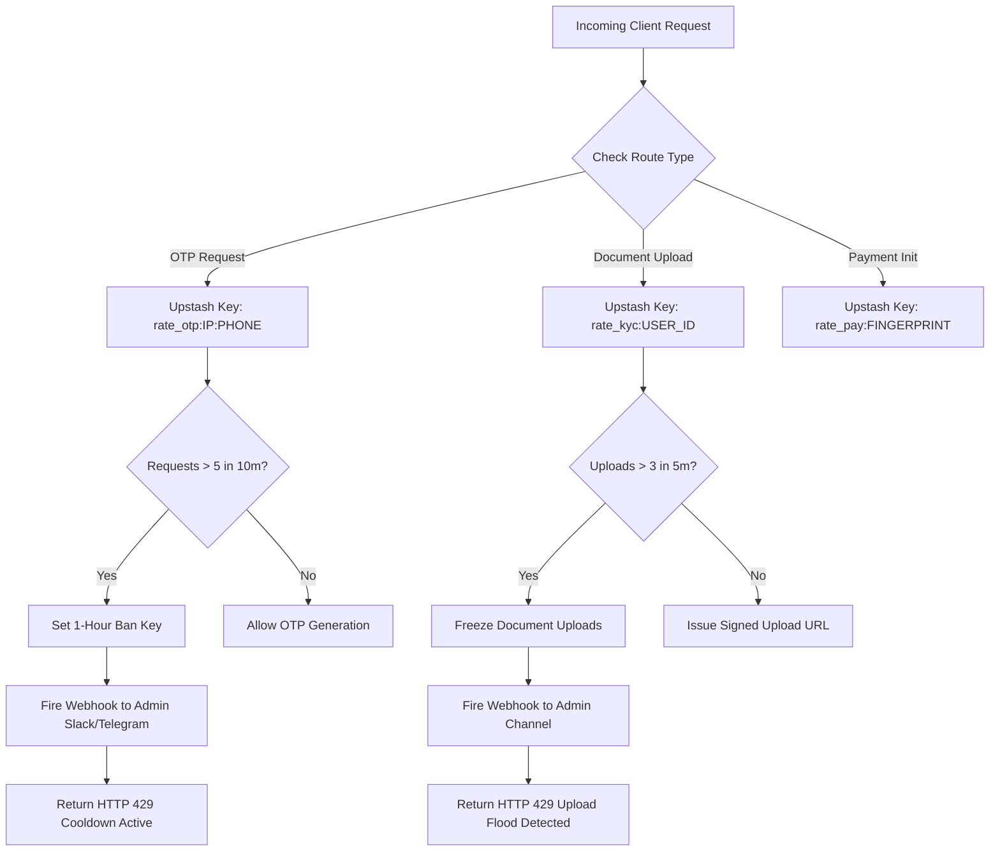
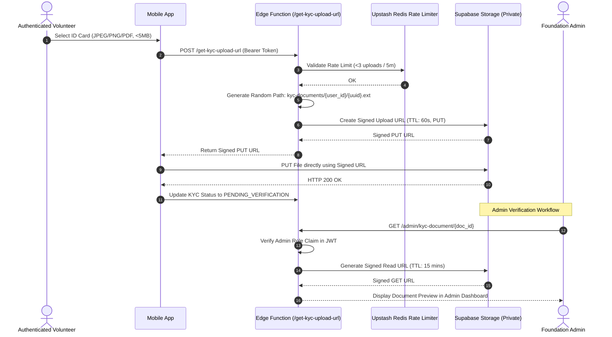
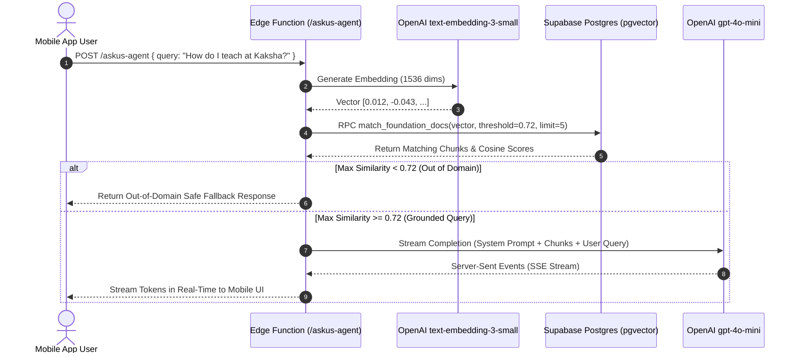

# SYSTEM ARCHITECTURE & TECHNICAL BLUEPRINT
## Project: AskUs Foundation Mobile & Operations Platform
**Document Version:** 2.0.0-FROZEN  
**Phase:** Gate 2 (Architecture Blueprint & Dependency Locking)  
**Status:** FROZEN & SIGNED OFF  
**Classification:** Foundation Engineering Standard  

---

## 1. HIGH-LEVEL ARCHITECTURAL TOPOLOGY

The AskUs Foundation platform enforces a strict three-tier architecture separating the **Client Application Layer**, the **Edge Security & Gateway Perimeter**, and the **Unified BaaS Data Core (Supabase)**.



---

## 2. FROZEN PRODUCTION DEPENDENCY MATRIX

Every dependency below is strictly locked. No alternative libraries, untracked protocols, or extraneous third-party SaaS services are permitted.

### 2.1 Client Application Layer (Expo / React Native)

| Library / Package | Locked Version | Architectural Role | Isolation / Boundary Rule |
| :--- | :--- | :--- | :--- |
| `expo` | `~51.0.0` | Core Application Framework | Managed Expo workflow with prebuild capabilities. |
| `react-native` | `0.74.5` | Native Runtime Core | Standard React Native runtime engine. |
| `expo-router` | `~3.5.0` | File-based Routing Engine | Enforces grouped layouts `(auth)`, `(volunteer)`, `(supporter)`, `(admin)`. |
| `nativewind` | `^4.0.1` | Styling & Design System | Tailwind CSS v3 compiler for React Native components. |
| `tailwindcss` | `^3.4.0` | Utility CSS Framework | Configured with `nativewind/preset`. |
| `@sentry/react-native` | `~5.22.0` | Telemetry & Bug Trapping | Wraps `app/_layout.tsx` via `Sentry.wrap()`. Captures 100% of crashes. |
| `expo-notifications` | `~0.28.0` | Push Notification Transport | Interacts with FCM v1 topic subscriptions and direct unicast push. |
| `@supabase/supabase-js` | `^2.43.0` | Unified BaaS Client SDK | Manages Auth sessions, DB queries, RLS enforcement, and signed storage URLs. |
| `react-native-razorpay` | `^2.3.0` | Payment Gateway Mobile SDK | Native mobile checkout sheets for UPI, Cards, and NetBanking. |
| `zod` | `^3.23.8` | Schema Validation | Validates all forms, payloads, and API contracts at runtime. |
| `expo-location` | `~17.0.1` | GPS Geofencing Provider | Validates volunteer physical presence against drive coordinates. |
| `expo-camera` | `~15.0.1` | Field Photo Capture | Direct impact photographic evidence logging. |
| `expo-image-picker` | `~15.0.5` | KYC & SOS Document Selection| Pick and compress documents before secure transfer. |
| `expo-crypto` | `~13.0.2` | Cryptographic Utilities | Client-side payload hashing and unique device fingerprinting. |

### 2.2 Backend, Database & Storage Tier (Supabase BaaS)

| Component | Technology | Configuration & Security Isolation |
| :--- | :--- | :--- |
| **Relational Database** | PostgreSQL 15+ | Strict foreign keys, custom ENUMs, Row-Level Security (RLS) on 100% of tables. |
| **Vector Search Engine** | PostgreSQL `pgvector` | 1536-dimensional embeddings with Hierarchical Navigable Small World (`HNSW`) cosine indexing (`vector_cosine_ops`). |
| **Identity & Auth** | Supabase Auth | Native Phone SMS OTP wrapper (E.164 standard). Password logins disabled. |
| **Document Storage** | Supabase Storage | `kyc-documents` bucket. **Public access completely disabled**. Direct bucket browsing rejected. Access via short-lived presigned URLs only. |
| **Edge Compute Runtime** | Supabase Edge Functions | Deno TypeScript runtime. Zero cold-start latency serverless functions. |

### 2.3 Serverless & Edge Integrations

| Service Provider | Integration Protocol | Configuration & Thresholds |
| :--- | :--- | :--- |
| **Upstash Redis** | REST API over HTTPS | Distributed token-bucket rate limiter for OTP requests and document uploads. |
| **OpenAI** | REST API via Edge Function | `gpt-4o-mini` for inference, `text-embedding-3-small` for 1536-dim embeddings. |
| **Razorpay** | Webhook over HTTPS | HMAC-SHA256 signature verification on payment capture. Triggers 80G receipt issuance. |
| **Admin Alerts** | Webhook over HTTPS | Automated JSON payload dispatch to Telegram Bot and Slack `#alerts-security`. |

---

## 3. SUBSYSTEM ARCHITECTURAL SPECIFICATIONS

### 3.1 Sentry Bug Detection & Telemetry Architecture

1. **Client Root Wrapping:**
   The root component in `app/_layout.tsx` is wrapped in `Sentry.wrap()`.
2. **Automated Error Trapping Triggers:**
   - Unhandled JavaScript runtime errors.
   - Unhandled Promise rejections.
   - Native crashes (iOS Objective-C/Swift & Android Java/Kotlin).
   - Network API request latency exceeding 15,000ms.
3. **Telemetry Payload Privacy Standard:**
   - Device model, OS version, active route path, and network connectivity state.
   - **Privacy Rule:** User ID is anonymized (`SHA256(user_id)`). Zero PII (no phone numbers, KYC names, or PANs) may ever be dispatched to Sentry breadcrumbs or tags.



---

### 3.2 Threat Watchdog & Upstash Anomaly Engine

All inbound sensitive requests (OTP generation, KYC uploads, donations) pass through the Threat Watchdog Edge middleware backed by Upstash Redis.



#### Anomaly Thresholds & Action Matrix

| Violation Identifier | Monitored Metric | Threshold Window | Automated Action | Alert Target |
| :--- | :--- | :--- | :--- | :--- |
| `AUTH_BRUTE_FORCE` | Failed/Requested OTPs | > 5 attempts / 10 mins | 1-Hour IP & Phone ban (`HTTP 429`) | Telegram Bot + Slack |
| `UPLOAD_FLOODING` | KYC upload requests | > 3 uploads / 5 mins | Account upload freeze for 30 mins | Telegram Bot + Slack |
| `DONATION_VELOCITY` | Payment checkouts | > 3 checkouts / 1 min | Device fingerprint flagged; payment held | Slack `#alerts-finance` |
| `LOCATION_TAMPER` | Mock location detected | Single detection on check-in | Immediate check-in rejection (`HTTP 403`) | Coordinator Audit Log |

---

### 3.3 KYC Document Security & Presigned Storage Pipeline

To eliminate public exposure risks, documents never pass through public storage buckets.



1. **Quarantine Invariant:** The `kyc-documents` bucket has `public: false`. Public read operations return `403 Access Denied`.
2. **Signed PUT Window:** Upload tokens expire in **60 seconds**, limiting replay windows.
3. **Signed GET Window:** Admin review tokens expire in **15 minutes**, preventing stale document links from lingering in browser caches.

---

### 3.4 Grounded AI Agent Retrieval Pipeline (RAG)

The AskUs Intelligence Agent uses OpenAI embeddings and PostgreSQL `pgvector` to ensure 100% grounded answers.



#### Grounding Specifications
- **Chunking Standard:** 500 tokens with 50 token sliding overlap.
- **Index Type:** Hierarchical Navigable Small World (`HNSW`) index over `pgvector` with cosine distance operator `<=>`.
- **Similarity Threshold:** Strict cutoff of `0.72`. Queries with similarity `< 0.72` trigger an instant fallback refusal without calling the generation model, saving inference costs and eliminating hallucinations.

---

## 4. RELATIONAL DATABASE & ROW-LEVEL SECURITY (RLS) CONTRACTS

### 4.1 Custom Database ENUMs
```sql
CREATE TYPE user_role_enum AS ENUM ('SUPPORTER', 'FIELD_VOLUNTEER', 'COORDINATOR_ADMIN');
CREATE TYPE kyc_status_enum AS ENUM ('NOT_SUBMITTED', 'PENDING_VERIFICATION', 'VERIFIED', 'REJECTED', 'SUSPENDED');
CREATE TYPE foundation_wing_enum AS ENUM ('EDUCATION', 'WOMEN_EMPOWERMENT', 'ANIMAL_WELFARE', 'ENVIRONMENT');
CREATE TYPE drive_status_enum AS ENUM ('DRAFT', 'PUBLISHED', 'IN_PROGRESS', 'COMPLETED', 'CANCELLED');
CREATE TYPE rsvp_status_enum AS ENUM ('CONFIRMED', 'WAITLISTED', 'CANCELLED');
CREATE TYPE sos_category_enum AS ENUM ('ANIMAL_DISTRESS', 'CHILD_EDUCATION_DEFICIT', 'WOMEN_HEALTH_EMERGENCY', 'ENVIRONMENTAL_HAZARD');
CREATE TYPE sos_status_enum AS ENUM ('OPEN_TRIAGE', 'ASSIGNED', 'RESOLVED', 'FALSE_ALARM');
CREATE TYPE threat_severity_enum AS ENUM ('LOW', 'MEDIUM', 'HIGH', 'CRITICAL');
```

### 4.2 Row-Level Security (RLS) Isolation Principles
1. **User Profile Isolation:** Users can read and update only their own profile (`auth.uid() = id`).
2. **Unverified Volunteer Quarantine:** A volunteer can create an RSVP or attendance record **if and only if** their profile has `kyc_status = 'VERIFIED'`.
3. **Admin Exclusivity:** Mutually exclusive role claims verified through an `is_admin()` database security definer function. Only administrators can alter drive status, approve/reject KYC records, or view watchdog incident feeds.

---

## 5. DIRECTORY SCAFFOLD & CODEBASE ORGANIZATION

The repository adheres strictly to the Expo Router v3 layout:

```text
c:\Users\anany\OneDrive\Desktop\AskUs\
├── app/
│   ├── (auth)/
│   │   ├── _layout.tsx
│   │   ├── login.tsx             # Phone number E.164 input
│   │   └── verify-otp.tsx        # 6-digit OTP verification
│   ├── (volunteer)/
│   │   ├── _layout.tsx           # Volunteer tab layout with KYC gatekeeper
│   │   ├── index.tsx             # Volunteer dashboard & active drives
│   │   ├── drives/
│   │   │   ├── [id].tsx          # Drive details, RSVP, and coordinator contacts
│   │   │   └── check-in.tsx      # GPS-validated check-in screen
│   │   ├── kyc.tsx               # Document upload and verification status tracker
│   │   └── logbook.tsx           # Field impact and metrics reporting
│   ├── (supporter)/
│   │   ├── _layout.tsx           # Supporter tab layout
│   │   ├── index.tsx             # Foundation public wings overview
│   │   ├── donate.tsx            # Razorpay donation checkout & 80G form
│   │   ├── sos.tsx               # Emergency distress / animal rescue reporter
│   │   └── agent.tsx             # Grounded AskUs Intelligence chat screen
│   ├── (admin)/
│   │   ├── _layout.tsx           # Elevated Admin navigation
│   │   ├── index.tsx             # Operational command center
│   │   ├── kyc-approvals.tsx     # Volunteer document review queue
│   │   ├── drives-manager.tsx    # Drive scheduling and roster allocation
│   │   └── threats.tsx           # Real-time watchdog threat incident feed
│   ├── _layout.tsx               # Root layout, Sentry.wrap, Providers
│   └── index.tsx                 # Root entrypoint with persona router
├── src/
│   ├── components/               # Atomic UI components
│   ├── hooks/                    # useAuth, useDrives, useThreatWatcher, useAI
│   ├── services/                 # Supabase, Sentry, FCM, Razorpay clients
│   ├── types/                    # Database, Auth, API contracts
│   └── utils/                    # Validators (Zod), formatters, geofence utils
├── supabase/
│   ├── functions/                # Deno Edge Functions (askus-agent, verify-threats, upload-url)
│   └── migrations/               # PostgreSQL schema & RLS definitions
├── app.json                      # Expo configuration
├── package.json                  # Locked dependency manifest
└── tsconfig.json                 # Strict TypeScript configuration
```

---

## 6. GATE 2 SIGN-OFF & COMPLETION CRITERIA

- [x] **Strict Dependency Locking:** Expo SDK 51, Expo Router v3, NativeWind v4, `@sentry/react-native`, `@supabase/supabase-js`, `react-native-razorpay` locked without unapproved third-party dependencies.
- [x] **Subsystem Telemetry:** `Sentry.wrap` architecture and privacy rules specified.
- [x] **Watchdog & Anomaly Engine:** Upstash Redis token-bucket thresholds and automated webhook triggers defined.
- [x] **KYC Security Pipeline:** Private bucket with signed PUT (60s) and signed GET (15m) URLs.
- [x] **RAG Retrieval Engine:** Cosine similarity threshold >= 0.72 with HNSW index and SSE streaming.
- [x] **Database & RLS Integrity:** Custom enums and mutually exclusive access policies established.
- [x] **Scaffold Directory Structure:** Enforced across all layers.
