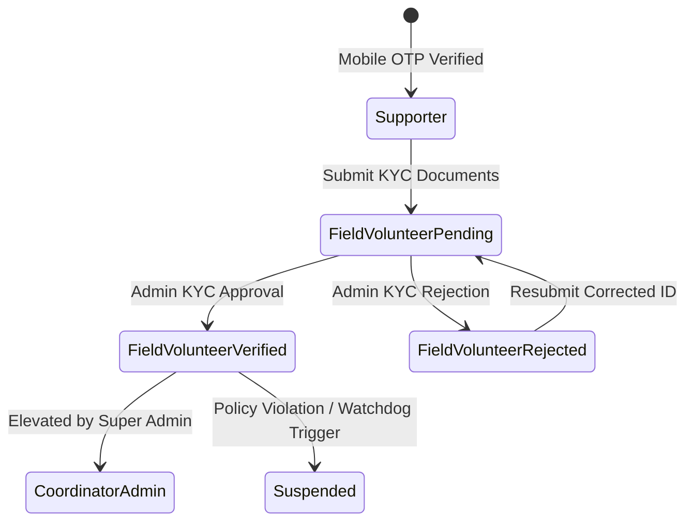
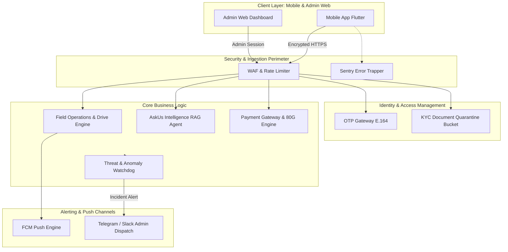
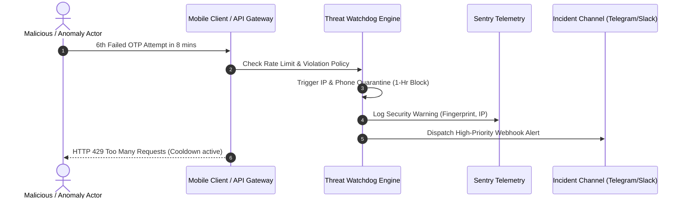
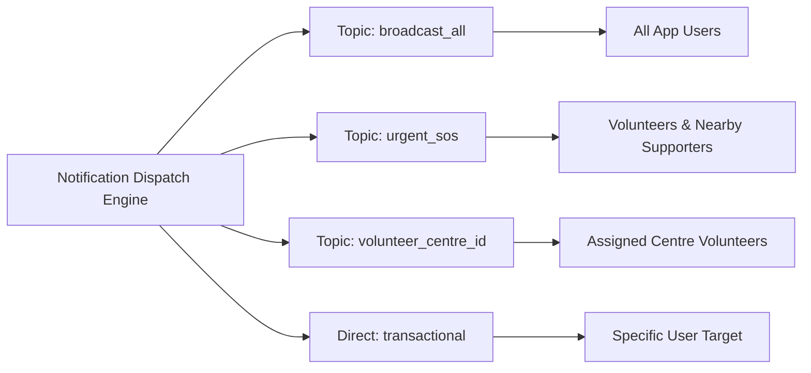

# PRODUCT REQUIREMENTS DOCUMENT (PRD)
## Project: AskUs Foundation Mobile & Operations Platform
**Document Version:** 1.0.0-FROZEN  
**Phase:** Gate 1 (Scope Freezing & System Boundaries)  
**Status:** FROZEN & SIGNED OFF  
**Classification:** Foundation Operational Standard  

---

## 1. EXECUTIVE SUMMARY & SYSTEM VISION

The **AskUs Foundation Mobile & Operations Platform** is a unified digital ecosystem designed to streamline civic engagement, volunteer mobilization, emergency response, and donor transparency across the foundation's four operational wings:
1. **AskUs Kaksha / EmpowerEd:** Education drives, slum tutoring centres, and student mentorship.
2. **Revolution नारी (Nari):** Women empowerment, menstrual hygiene awareness, vocational training, and self-help group initiatives.
3. **Pawer Rangers:** Stray animal rescue, street feeding programs, vaccination drives, and emergency veterinary triage.
4. **Green Squad:** Urban afforestation, seed-bombing, cleanup drives, and community sustainability campaigns.

The platform establishes an uncompromising security perimeter, automated identity validation (Mobile OTP + KYC), geo-fenced field accountability, grounded conversational intelligence (RAG), and proactive security telemetry.

---

## 2. ACTOR DEFINITIONS & ROLE-BASED ACCESS CONTROL (RBAC)

### 2.1 Mutually Exclusive Actor Personas

The system strictly enforces role segregation. An account operates under **one active persona** per session. Elevation to Administrative privileges requires multi-factor verified credentials and explicit assignment by a Super Admin.



| Actor Persona | Description | Primary Authentication | Lifecycle States |
| :--- | :--- | :--- | :--- |
| **Supporter / Public User** | Donors, citizens reporting animal/social distress, general public. | Mobile OTP (E.164) | `ACTIVE`, `BANNED` |
| **Field Volunteer / Educator** | Ground volunteers conducting drives, teachers, animal rescuers. | Mobile OTP + Verified KYC | `REGISTERED`, `PENDING_VERIFICATION`, `VERIFIED`, `REJECTED`, `SUSPENDED` |
| **Foundation Coordinator / Admin** | Wing heads, centre leaders, foundation trustees, security officers. | Mobile OTP + Admin Role Claim | `ACTIVE`, `REVOKED` |

---

### 2.2 Granular RBAC Permissions Matrix

| Functional Capability / Domain | Supporter / Public | Field Volunteer (Unverified: `PENDING`/`REJECTED`) | Field Volunteer (`VERIFIED`) | Foundation Coordinator / Admin |
| :--- | :---: | :---: | :---: | :---: |
| **View Foundation Public Wings & Impact** | READ | READ | READ | READ / WRITE |
| **AskUs Intelligence Agent (RAG)** | READ (Query) | READ (Query) | READ (Query) | READ / ADMIN CONSOLE |
| **Public Donation & 80G Receipt Issuance** | EXECUTE / READ OWN | EXECUTE / READ OWN | EXECUTE / READ OWN | RECONCILE / AUDIT ALL |
| **Public Beneficiary / SOS Submission** | CREATE / READ OWN | CREATE / READ OWN | CREATE / READ OWN | TRIAGE / ASSIGN / CLOSE |
| **KYC Document Submission** | N/A | CREATE / RESUBMIT | READ OWN STATUS | AUDIT / APPROVE / REJECT |
| **View Drive Listings & Centre Schedules** | READ (Public) | READ (Public) | READ (All Drives) | FULL ACCESS |
| **RSVP to Drives & Relief Operations** | BLOCKED (403) | **BLOCKED (403)** | CREATE / CANCEL OWN | ROSTER OVERRIDE |
| **Geo-fenced Attendance Logging** | BLOCKED (403) | **BLOCKED (403)** | EXECUTE (Geo-verified) | AUDIT / MANUAL OVERRIDE |
| **Field Impact & Centre Logbook Entry** | BLOCKED (403) | **BLOCKED (403)** | CREATE / READ OWN | AUDIT / EXPORT |
| **Threat & Watchdog Security Alerts** | BLOCKED (403) | BLOCKED (403) | BLOCKED (403) | RECEIVE / RESOLVE |
| **User Role & Centre Roster Management** | BLOCKED (403) | BLOCKED (403) | BLOCKED (403) | FULL ADMIN WRITE |

---

### 2.3 Unverified Volunteer Access Boundary & Edge Case Resolution

To maintain operational discipline, child safety at AskUs Kaksha centres, and animal safety during Pawer Rangers rescues, unverified volunteers are strictly quarantined:

1. **Gatekeeping Invariant:** If `account_status != 'VERIFIED'`, any attempt to interact with volunteer-only endpoints (`/api/v1/drives/rsvp`, `/api/v1/drives/check-in`, `/api/v1/impact/log`) yields `HTTP 403 Forbidden` with standardized error payload:
   ```json
   {
     "error_code": "ERR_VOLUNTEER_KYC_UNVERIFIED",
     "message": "Access restricted. Your identity document is currently undergoing verification.",
     "current_status": "PENDING_VERIFICATION",
     "action_required": "WAIT_FOR_APPROVAL"
   }
   ```
2. **Client State Lockdown:**
   - The volunteer tab replaces action buttons (RSVP, Check-In) with an immutable progress tracker showing submission timestamp and verification status.
   - If `status == 'REJECTED'`, the UI renders the rejection reason provided by Admin with a single action: "Upload Valid Government ID".
3. **Revocation Ripple Effect:** If an admin marks a verified volunteer as `SUSPENDED` or `REJECTED`, active session claims are invalidated via token revocation within 60 seconds, immediately booting the user from volunteer-only workflows.

---

## 3. CORE SYSTEM CAPABILITIES & OPERATIONAL SPECIFICATIONS



---

### 3.1 Authentication & Identity Management (Mobile OTP + KYC Pipeline)

#### 3.1.1 Zero-Password Mobile OTP Specification
- **Primary Unique Identifier:** Phone number in strict international **E.164** format (e.g., `+919876543210`).
- **OTP Generation & Security:**
  - Length: 6 numerical digits generated via cryptographically secure pseudo-random number generator (CSPRNG).
  - Validity Window: Exactly 300 seconds (5 minutes). Single-use only.
  - Verification Attempts: Maximum 3 attempts per OTP token. On 3rd failure, the token is invalidated.
  - Delivery Transport: SMS Gateway with automatic SMS Retriever API integration for Android and SMS AutoFill for iOS.

#### 3.1.2 Mandatory Volunteer KYC Pipeline
1. **Required Profile Attributes:**
   - Legal Full Name (as per official identity card).
   - Primary Phone Number (validated via OTP).
   - Emergency Contact: Name, Relationship, and Phone Number (E.164).
   - Operating City & Designated Primary Foundation Centre (e.g., `DELHI_SOUTH_CENTRE_01`).
   - Official Identification Document: Type selection from `AADHAAR`, `VOTER_ID`, `DRIVING_LICENSE`, `PASSPORT`, `STUDENT_ID`.
2. **Document Quarantine & Privacy Rules (Zero Public Exposure):**
   - File Constraints: Supported formats `image/jpeg`, `image/png`, `application/pdf`. Maximum size: 5 MB.
   - Storage Architecture:
     - Document upload directly to isolated private storage container: `kyc-documents/quarantine/{user_id}/{timestamp}_{doc_hash}.ext`.
     - **Strict Cloud Security Policy:** Storage bucket ACL set to private. Zero public read access permitted under any network condition. Direct bucket browsing disabled.
     - Files encrypted at rest using AES-256 with foundation KMS keys.
   - Admin Access Protocol:
     - Foundation coordinators access documents exclusively via short-lived, presigned URLs generated on-demand with a maximum **TTL of 15 minutes**.
     - Every presigned URL generation event is recorded in the permanent audit ledger containing Admin ID, User ID, Target Document, and Timestamp.

---

### 3.2 AskUs Intelligence Agent (Foundation RAG Specification)

The AskUs Intelligence Agent is an in-app grounded assistant designed to orient supporters and field volunteers with authoritative foundation knowledge.

#### 3.2.1 Operational Boundaries & Out-of-Domain Guardrails
- **Scope Mandate:** Responds **only** to inquiries related to AskUs Foundation history, vision, wings, operations, schedules, donation transparency, 80G tax exemptions, and volunteer SOPs.
- **Strict Out-of-Domain Guardrail:**
  - Queries concerning general coding, partisan politics, entertainment trivia, general mathematics, competitor internal matters, or malicious prompt injections must be rejected deterministically.
  - **Standard Rejection Response:**
    > "I am the AskUs Foundation Assistant, dedicated exclusively to supporting our community initiatives, education drives, animal rescues, environmental actions, and donation queries. I cannot assist with topics outside our foundation's work. How can I help you regarding our initiatives today?"

#### 3.2.2 Grounding Knowledge Corpus Reference Hierarchy
1. **AskUs Kaksha / EmpowerEd:** Standard Teaching Curriculum (Grade 1-8 foundational literacy & numeracy), child safeguarding protocols, background check requirements, educator code of conduct.
2. **Revolution नारी:** Community workshop guidelines, sanitary napkin distribution protocols, dignified communication standards, beneficiary identity confidentiality policies.
3. **Pawer Rangers:** Stray dog/cat first-aid triage, dog-bite prevention SOP, rabies protocol, emergency veterinarian helpline network, transport cage sanitation.
4. **Green Squad:** Native tree species guide for Indian climate zones, post-plantation care schedule (watering & weeding), cleanup equipment handling & hazardous waste safety.
5. **Donation & Fiscal Integrity:** Foundation legal status, 80G tax rebate eligibility, 12A registration details, FCRA statement, receipt retrieval steps.

---

### 3.3 Automated Threat & Anomaly Watchdog

The Watchdog subsystem executes real-time telemetry inspection, anomaly detection, and automated incident escalation.



#### 3.3.1 Deterministic Anomaly Traps & Rules

| Anomaly Identifier | Detection Threshold / Trigger | Automated Mitigation Action | Severity |
| :--- | :--- | :--- | :---: |
| **AUTH_BRUTE_FORCE** | >5 failed OTP attempts within a sliding 10-minute window for a specific phone number or IP. | - Immediate 60-minute quarantine on phone number and originating IP.<br>- Temporary lockout token issued.<br>- Rate limit HTTP 429 returned. | `HIGH` |
| **DONATION_VELOCITY** | >3 successful or failed payment initializations within 60 seconds from the same device fingerprint. | - Gateway session frozen for device.<br>- Flag transaction as `SUSPICIOUS_VELOCITY`.<br>- Require admin audit before fund settlement. | `CRITICAL` |
| **PAYLOAD_TAMPERING** | Upload payload MIME type mismatch (e.g., `.exe`/`.sh` disguised as `.jpg`) or file size > 5 MB. | - Immediate drop of connection.<br>- File discarded from memory.<br>- Flag user session for security review. | `HIGH` |
| **GEOFENCE_SPOOFING** | Mock location provider detected, GPS accuracy radius > 50 meters, or impossible travel speed between consecutive check-ins. | - Attendance marked `REJECTED_LOCATION_ANOMALY`.<br>- Volunteer log entry flagged for coordinator review. | `MEDIUM` |
| **UNCAUGHT_EXCEPTION** | Any unhandled runtime exception or 5xx server crash. | - Client/Backend Sentry SDK captures 100% stack trace, device state, and user ID.<br>- Return sanitized error to client. | `HIGH` |

#### 3.3.2 Automated Webhook Dispatch Payload
All triggered anomalies and unhandled crashes dispatch an automated JSON webhook to the Foundation Security Channel (`Slack #alerts-ops` / `Telegram Admin Bot`):

```json
{
  "incident_id": "SEC-2026-0908-8841",
  "timestamp": "2026-09-08T06:37:00+05:30",
  "severity": "HIGH",
  "rule_triggered": "AUTH_BRUTE_FORCE",
  "actor": {
    "phone_masked": "+91-98765-XXXXX",
    "ip_address": "103.21.244.18",
    "device_fingerprint": "a7b9c43d8e02f1a"
  },
  "context": {
    "failed_attempts": 6,
    "window_seconds": 480,
    "cooldown_expiry": "2026-09-08T07:37:00+05:30"
  },
  "sentry_event_id": "9b1284d3e5f74a81bc2014bdf881c192",
  "action_taken": "IP_AND_PHONE_QUARANTINE_60_MIN"
}
```

---

### 3.4 Field Operations & Drive Tracking

#### 3.4.1 Drive Entity Specifications
Every field initiative is encapsulated in a formal `Drive` schema:

| Field Name | Type | Constraints / Format | Description |
| :--- | :--- | :--- | :--- |
| `drive_id` | UUIDv4 | Non-null, Primary Key | Unique drive identifier. |
| `title` | String | Max 100 chars | Descriptive title of the activity. |
| `wing` | Enum | `EDUCATION`, `WOMEN_EMPOWERMENT`, `ANIMAL_WELFARE`, `ENVIRONMENT` | Target wing governance. |
| `centre_id` | String | Foreign Key | Associated foundation centre / chapter. |
| `coordinator_id`| UUIDv4 | Foreign Key | Foundation coordinator responsible on ground. |
| `geo_location` | Object | `{ "latitude": Float, "longitude": Float, "geofence_radius_meters": 200 }` | Drive coordinates and valid check-in radius. |
| `landmark` | String | Max 200 chars | Human-readable meeting spot. |
| `slot_capacity` | Integer | Min 1, Max 250 | Total volunteer capacity permitted. |
| `start_time` | Timestamp | ISO 8601 UTC | Scheduled start. |
| `end_time` | Timestamp | ISO 8601 UTC | Scheduled conclusion. |
| `status` | Enum | `DRAFT`, `PUBLISHED`, `IN_PROGRESS`, `COMPLETED`, `CANCELLED` | Operational lifecycle status. |

#### 3.4.2 Volunteer Drive Actions & Attendance Verification
1. **RSVP Rules:**
   - Only `VERIFIED` volunteers can execute an RSVP.
   - If `current_rsvp_count < slot_capacity`, state is `CONFIRMED`.
   - If `current_rsvp_count >= slot_capacity`, state is `WAITLISTED`.
   - Volunteers can cancel up to 2 hours prior to `start_time`, automatically promoting the next waitlisted volunteer.
2. **Geo-Fenced & Time-Stamped Check-in Invariant:**
   - **Time Window:** Allowed between `[start_time - 30 minutes]` and `end_time`.
   - **Geographic Distance:** Must compute Haversine distance between device GPS coordinate and drive `geo_location`. Check-in is valid **if and only if** \( \text{distance} \le \text{geofence\_radius\_meters} \) (default: 200m).
   - **Accuracy Threshold:** Device reported GPS accuracy must be \(\le 50\text{ meters}\). Mock location flags reject the check-in immediately.
3. **Impact Logging & Centre Logbook:**
   - After check-in, volunteer logs: metric counters (e.g. students taught, stray dogs fed, trees planted) and up to 5 on-site photographs (watermarked with timestamp and GPS coordinates).

---

### 3.5 Notification Engine (FCM / APNs)

#### 3.5.1 Segmented Topic Architecture



1. `broadcast_all`: Major foundation milestones, annual reports, nationwide campaigns. (Low frequency, opt-out available).
2. `urgent_sos`: Animal rescue alerts, rapid relief drives, urgent blood/rations requests. (High priority, geolocated dispatch).
3. `volunteer_{centre_id}`: Centre-specific shift rosters, classroom schedule changes, material requisitions. (Subscribed based on volunteer centre affiliation).
4. `transactional`: Direct unicast push / SMS fallback for OTP verification, KYC status changes, and instant 80G donation receipts. (Zero opt-out, high priority delivery).

---

### 3.6 Public Beneficiary & Emergency SOS Intake

Supporters and public citizens can report emergency community needs or animal distress:
1. **Payload Attributes:**
   - Category (`ANIMAL_DISTRESS`, `CHILD_EDUCATION_DEFICIT`, `WOMEN_HEALTH_EMERGENCY`, `ENVIRONMENTAL_HAZARD`).
   - Geo-coordinates (captured via device GPS) + Nearest Landmark.
   - Narrative Description (up to 500 characters).
   - Up to 3 Evidence Images (compressed, sanitized JPEG/PNG).
   - Reporter Contact Number (validated via OTP to deter prank submissions).
2. **Triage Pipeline:**
   - Dispatches instant notification to topic `urgent_sos` within the specific city cluster.
   - Appears on Foundation Coordinator dashboard with status `OPEN_TRIAGE`. Coordinator can assign to an active field volunteer or mark as `RESOLVED`.

---

### 3.7 Donation Gateway & 80G Receipt Issuance

1. **Payment Gateway Integration:**
   - Support for Unified Payments Interface (UPI Intent / QR), Credit Cards, Debit Cards, and NetBanking via RBI-compliant gateway.
2. **Automated 80G Tax Exemption Receipt:**
   - Indian donors may input PAN (Permanent Account Number) for Section 80G tax benefit eligibility.
   - On successful webhook confirmation from payment gateway:
     - Cryptographically signs and generates sequential 80G PDF receipt.
     - Logs record in immutable ledger (`donations_ledger`).
     - Dispatches PDF receipt instantly via Email/SMS and makes it available in the Supporter's app receipt vault.

---

## 4. FROZEN SCOPE MATRIX (MVP vs. PHASE 2)

To guarantee architectural stability and timely delivery of Gate 1, all platform features are permanently assigned to either Phase 1 (MVP) or Phase 2.

| System Capability | MVP Phase 1 (FROZEN IN-SCOPE) | Phase 2 (EXPLICITLY OUT-OF-SCOPE) | Rationale & Trade-off Consideration |
| :--- | :---: | :---: | :--- |
| **Authentication** | Mobile OTP (E.164) + Session Token Management | Social Logins (Google/Apple), Biometric FaceID login | Passwordless OTP is the universal baseline in target demographics. |
| **Volunteer KYC** | Document Upload (Aadhaar/ID) + Admin Manual Audit Workflow | Automated OCR & Real-Time Govt API Aadhaar Verification | Admin verification avoids third-party government API recurring costs during early rollout. |
| **Field Drives** | Drive Feed, RSVP, Geo-fenced Check-in, Post-drive photo log | Dynamic Route Planning, Volunteer Carpooling / Ride-sharing | Core need is presence verification and roster control. |
| **AskUs AI Assistant** | Grounded Foundation RAG, strict out-of-domain refusal | Multilingual Voice-to-Voice AI, Real-time translation | Text-based grounded RAG ensures deterministic knowledge delivery without voice latency. |
| **Communications** | 1-Way Push Notifications (Topics + Transactional) | Peer-to-Peer Volunteer Chat, In-App Group Messaging | P2P messaging requires massive moderation and moderation liability; deferred to Phase 2. |
| **NGO Commerce** | In-app 80G Donation Flow with Instant PDF Receipt | NGO Craft E-commerce Store, Merchandise Marketplace | Fund collection is mission-critical; physical logistics & order tracking belong to Phase 2. |
| **Database Sync** | Online-only REST/GraphQL API with optimistic local cache | Offline-first distributed conflict-free sync (CRDTs) | Connectivity is ubiquitous in operating centres; distributed offline sync introduces unnecessary complexity. |
| **Gamification** | Basic Drive Count & Hours Metric on Profile | Leaderboards, Point Redemption, NFT Badges, Social Feeds | Focus is altruistic volunteer utility and operational integrity, not gamified vanity metrics. |
| **Security & Watchdog**| Rate-limiters, Sentry error trapping, Slack/Telegram webhook | Automated IP blacklisting via Cloudflare API, AI Fraud Score | High-leverage webhooks provide instant visibility to core team without complex infra overhead. |

---

## 5. GATE 1 CRITERIA FOR COMPLETION & SIGN-OFF AUDIT

Every mandatory architectural gate has been satisfied with zero ambiguity:

- [x] **Unverified Volunteer Boundary:** Explicit state machine defined. Users in `REGISTERED`, `PENDING_VERIFICATION`, or `REJECTED` states are strictly locked to read-only access on field drives, RSVPs, attendance logging, and centre logbooks. HTTP 403 `ERR_VOLUNTEER_KYC_UNVERIFIED` enforced.
- [x] **Document Privacy Guarantee:** Zero public read access permitted. Upload path quarantined in private cloud storage (`kyc-documents/quarantine`). Admin viewing restricted to 15-minute presigned URLs with mandatory access logging.
- [x] **Mutually Exclusive RBAC:** Actor roles (`Supporter`, `Field Volunteer`, `Foundation Coordinator / Admin`) are segregated. Elevated permissions require explicit admin promotion and cannot bleed into public supporter contexts.
- [x] **Telemetry & Threat Trapping:** Strict thresholds defined for OTP brute forcing (>5/10 min), donation velocity (>3/min), payload sanitation (5MB, magic byte check), and geo-spoofing with automated webhook dispatch to Telegram/Slack.
- [x] **RAG Intelligence Boundaries:** Defined system prompt guardrails with deterministic rejection of out-of-domain queries, grounded exclusively in AskUs wings, SOPs, and donation regulations.
- [x] **Scope Boundaries Frozen:** Comprehensive matrix separating MVP deliverables from Phase 2 exclusions.

---

### SIGN-OFF CONFIRMATION
* **Gate Status:** **GATE 1 APPROVED & FROZEN**  
* **Next Authorized Milestone:** Step 2 - Database Architecture, Entity-Relationship Models & API Contract Design.
